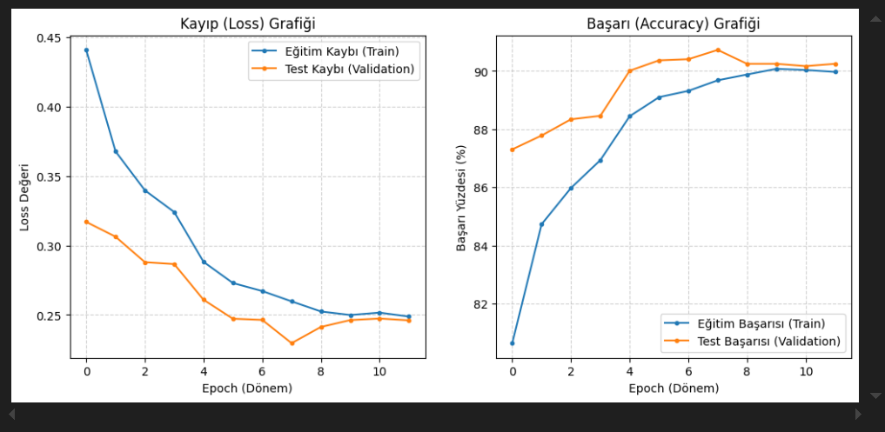
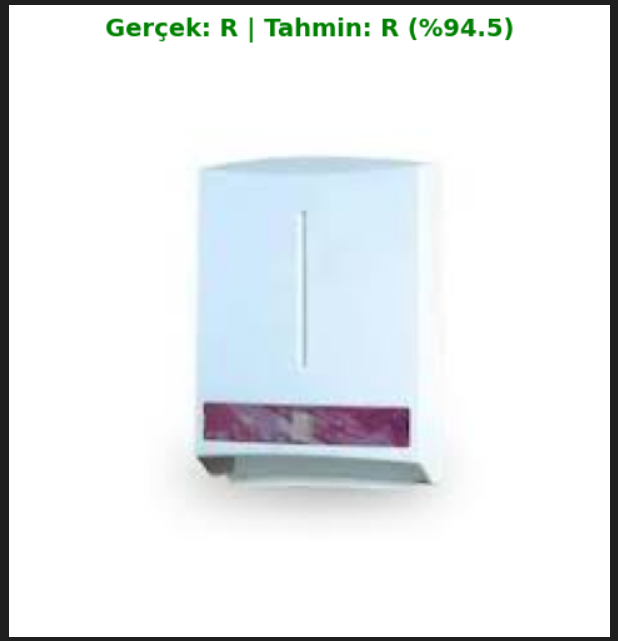

# ♻️ Atık Sınıflandırma Projesi (Waste Classification with CNN)

Bu proje, **Derin Öğrenme (Deep Learning)** ve **CNN (Convolutional Neural Networks)** mimarisini kullanarak atık görüntülerini **"Organic" (Organik)** ve **"Recyclable" (Geri Dönüştürülebilir)** olarak sınıflandıran bir yapay zeka uygulamasıdır.

Proje, **PyTorch** kütüphanesi kullanılarak geliştirilmiştir ve veri setini Kaggle üzerinden otomatik olarak çeker. Veri artırma (augmentation) teknikleri ile modelin başarımı güçlendirilmiştir.

## 🚀 Özellikler

* **Otomatik Veri İndirme:** `kagglehub` entegrasyonu sayesinde veri seti manuel indirmeye gerek kalmadan otomatik olarak çekilir.
* **Veri Artırma (Data Augmentation):** Eğitim setindeki görüntüler rastgele döndürme, yatay çevirme ve renk değişimleri ile çoğaltılarak modelin ezberlemesi (overfitting) önlenir.
* **Özel CNN Mimarisi:** 3 Konvolüsyon katmanı, Pooling ve Dropout katmanları içeren, bu problem için özelleştirilmiş bir model yapısı.
* **Görselleştirme:** Eğitim süreci boyunca *Loss (Kayıp)* ve *Accuracy (Başarı)* grafikleri canlı olarak takip edilebilir.
* **Canlı Tahmin:** Eğitilmiş model, kullanıcının verdiği herhangi bir yeni resim üzerinde anlık tahmin yapabilir.

---

## 📊 Eğitim Sonuçları ve Grafikler

Modelin eğitim süreci boyunca elde edilen Başarı (Accuracy) ve Kayıp (Loss) değişim grafikleri aşağıda sunulmuştur. Grafikler, modelin istikrarlı bir şekilde öğrendiğini göstermektedir.



| Metrik | Hedeflenen Başarı |
| :--- | :--- |
| **Eğitim Doğruluğu** | %90 Üzeri |
| **Test Doğruluğu** | %85 Üzeri |

---

## 🖼️ Örnek Tahmin Çıktısı

Modelin, test veri seti üzerinden daha önce hiç görmediği bir görüntüyle yaptığı örnek sınıflandırma tahmini ve güven skoru:



---

## 📂 Veri Seti

Bu projede **Techsash Waste Classification Data** kullanılmıştır.

* **Kaynak:** [Kaggle - Waste Classification Data](https://www.kaggle.com/datasets/techsash/waste-classification-data)
* **Sınıflar (Binary Classification):**
    1.  **Organic:** Organik Atıklar (Sebze, meyve, yemek artıkları vb.)
    2.  **Recyclable:** Geri Dönüştürülebilir Atıklar (Plastik, cam, metal, kağıt vb.)

## 🛠️ Kurulum ve Kullanım

Projeyi yerel bilgisayarınızda çalıştırmak için aşağıdaki adımları izleyin.

### 1. Projeyi Klonlayın
Aşağıdaki komutta `KULLANICI_ADINIZ` yazan yeri kendi GitHub kullanıcı adınızla değiştirmeyi unutmayın:

```bash
git clone [https://github.com/KULLANICI_ADINIZ/atik-siniflandirma-projesi.git](https://github.com/KULLANICI_ADINIZ/atik-siniflandirma-projesi.git)
cd atik-siniflandirma-projesi